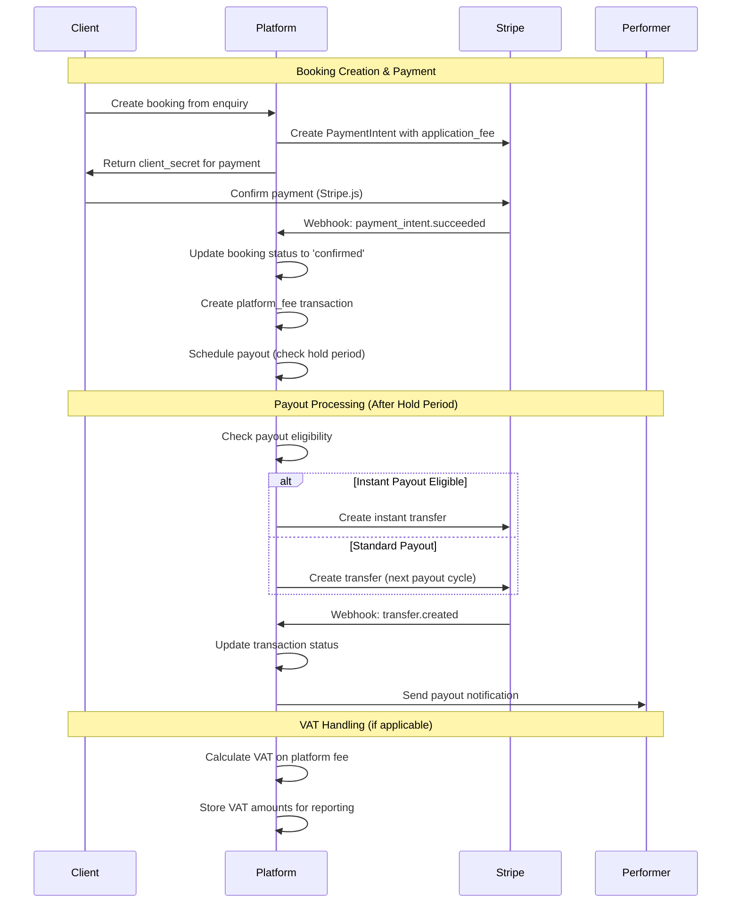
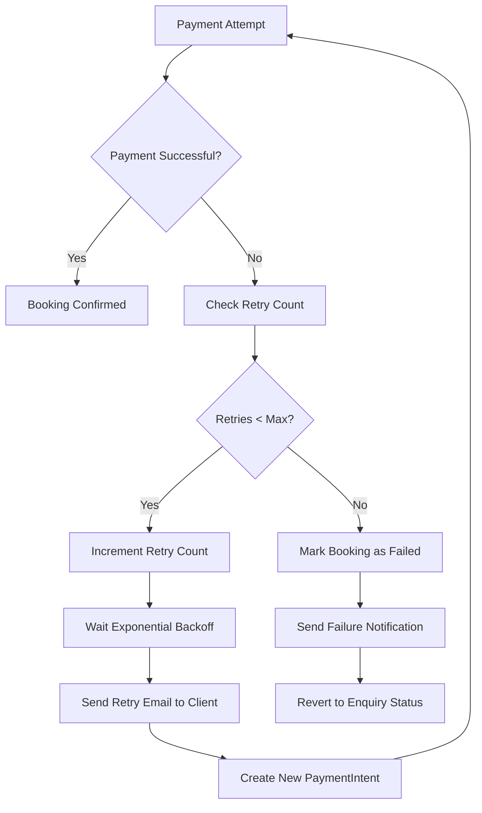
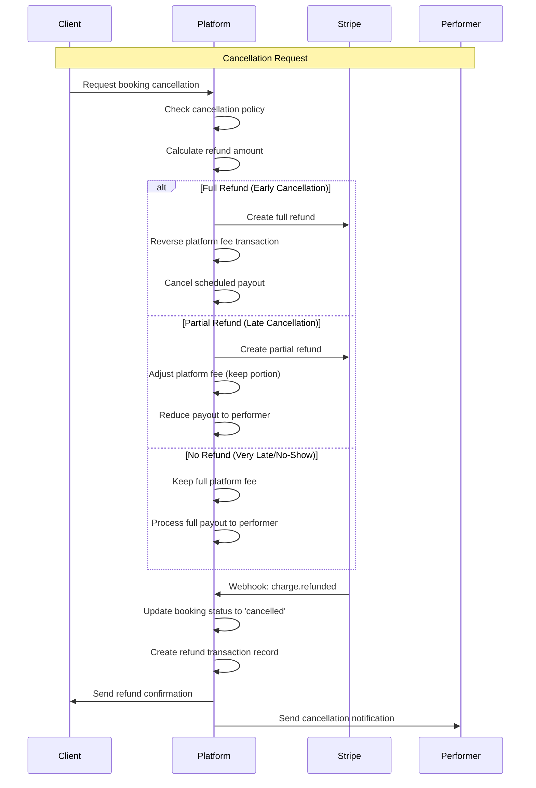
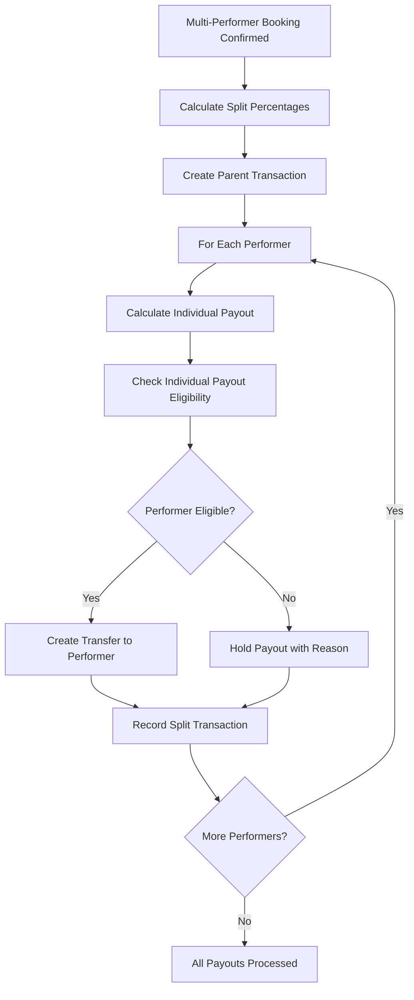

# Advanced Stripe Payment Flows - Performer Booking Platform

## 🎯 Overview

This document outlines advanced payment handling for our Stripe Connect-based booking platform, including complex scenarios like partial refunds, payment retries, payout delays, disputes, multi-performer events, and VAT support.

## 📊 Enhanced Database Schema Extensions

### Additional Fields for `bookings` Table

```sql
ALTER TABLE bookings ADD COLUMN IF NOT EXISTS
-- Advanced payment tracking
stripe_setup_intent_id VARCHAR(255),
stripe_customer_id VARCHAR(255),
payment_method_id VARCHAR(255),
payment_retry_count INTEGER DEFAULT 0,
last_payment_attempt_at TIMESTAMP,
payment_failure_reason TEXT,

-- Payout management
payout_hold_until TIMESTAMP,
payout_hold_reason VARCHAR(100), -- 'new_performer', 'dispute_risk', 'manual_review'
instant_payout_eligible BOOLEAN DEFAULT FALSE,
payout_processed_at TIMESTAMP,
payout_reference VARCHAR(100),

-- Refund handling
refund_amount DECIMAL(10,2) DEFAULT 0.00,
refund_reason VARCHAR(255),
refund_processed_at TIMESTAMP,
stripe_refund_id VARCHAR(255),

-- Multi-performer support
is_multi_performer BOOLEAN DEFAULT FALSE,
primary_performer_id INTEGER REFERENCES performers(id),
performer_split_data JSONB, -- Store split percentages

-- VAT/Tax support
vat_rate DECIMAL(5,2) DEFAULT 0.00,
vat_amount DECIMAL(10,2) DEFAULT 0.00,
tax_inclusive BOOLEAN DEFAULT TRUE,
performer_vat_number VARCHAR(50),

-- Dispute management
dispute_status VARCHAR(50), -- 'none', 'warning_needs_response', 'under_review', 'charge_refunded', 'lost', 'won'
dispute_reason VARCHAR(100),
dispute_created_at TIMESTAMP,
chargeback_amount DECIMAL(10,2) DEFAULT 0.00;
```

### Additional Fields for `transactions` Table

```sql
ALTER TABLE transactions ADD COLUMN IF NOT EXISTS
-- Enhanced Stripe tracking
stripe_balance_transaction_id VARCHAR(255),
stripe_source_transfer_id VARCHAR(255),
stripe_destination_payment_id VARCHAR(255),

-- Fee breakdown
stripe_fee_amount DECIMAL(10,2) DEFAULT 0.00,
platform_fee_vat DECIMAL(10,2) DEFAULT 0.00,
net_amount DECIMAL(10,2), -- Amount after all fees

-- Retry and failure handling
retry_count INTEGER DEFAULT 0,
max_retries INTEGER DEFAULT 3,
next_retry_at TIMESTAMP,
failure_code VARCHAR(50),
failure_message TEXT,

-- Split payment support
split_group_id VARCHAR(100), -- Group related transactions
split_percentage DECIMAL(5,2),
parent_transaction_id INTEGER REFERENCES transactions(id),

-- Dispute tracking
dispute_evidence_submitted BOOLEAN DEFAULT FALSE,
dispute_evidence_due_by TIMESTAMP,
chargeback_liability VARCHAR(50); -- 'platform', 'performer', 'shared'
```

### Additional Fields for `performers` Table

```sql
ALTER TABLE performers ADD COLUMN IF NOT EXISTS
-- Stripe Connect enhancements
stripe_account_status VARCHAR(50), -- 'pending', 'restricted', 'enabled'
stripe_charges_enabled BOOLEAN DEFAULT FALSE,
stripe_payouts_enabled BOOLEAN DEFAULT FALSE,
stripe_account_type VARCHAR(20) DEFAULT 'standard', -- 'standard', 'express', 'custom'

-- Payout eligibility
instant_payout_enabled BOOLEAN DEFAULT FALSE,
payout_schedule VARCHAR(20) DEFAULT 'weekly', -- 'daily', 'weekly', 'monthly', 'manual'
minimum_payout_amount DECIMAL(10,2) DEFAULT 10.00,
payout_hold_days INTEGER DEFAULT 7,

-- VAT/Tax information
vat_registered BOOLEAN DEFAULT FALSE,
vat_number VARCHAR(50),
tax_id VARCHAR(50),
tax_rate DECIMAL(5,2) DEFAULT 0.00,

-- Risk and verification
verification_status VARCHAR(50), -- 'unverified', 'pending', 'verified', 'rejected'
risk_level VARCHAR(20) DEFAULT 'normal', -- 'low', 'normal', 'elevated', 'highest'
total_dispute_count INTEGER DEFAULT 0,
dispute_ratio DECIMAL(5,4) DEFAULT 0.0000;
```

## 🔄 Advanced Payment Flow Diagrams

### 1. Complete Booking to Payout Flow



### 2. Payment Retry Flow for Failed Cards



### 3. Refund & Cancellation Flow



### 4. Multi-Performer Split Payout Flow



## 🎣 Required Stripe Webhooks

### Critical Webhooks (Must Handle)

```typescript
const CRITICAL_WEBHOOKS = [
  // Payment Processing
  'payment_intent.succeeded',
  'payment_intent.payment_failed',
  'payment_intent.requires_action',
  'payment_intent.canceled',
  
  // Transfers & Payouts
  'transfer.created',
  'transfer.updated',
  'transfer.failed',
  'transfer.reversed',
  
  // Account Management
  'account.updated',
  'account.application.deauthorized',
  'capability.updated',
  
  // Disputes & Chargebacks
  'charge.dispute.created',
  'charge.dispute.updated',
  'charge.dispute.closed',
  'charge.dispute.funds_withdrawn',
  'charge.dispute.funds_reinstated',
  
  // Refunds
  'charge.refunded',
  'refund.created',
  'refund.updated',
  'refund.failed'
];
```

### Enhanced Webhook Handlers

```typescript
// Enhanced payment intent handler
async function handlePaymentIntentSucceeded(event: Stripe.Event) {
  const paymentIntent = event.data.object as Stripe.PaymentIntent;
  const bookingId = paymentIntent.metadata.bookingId;
  
  await db.transaction(async (trx) => {
    // Update booking
    await trx('bookings')
      .where('booking_id', bookingId)
      .update({
        status_id: await getStatusId('confirmed'),
        confirmed_at: new Date(),
        stripe_payment_intent_id: paymentIntent.id,
        payment_method_id: paymentIntent.payment_method,
        payment_retry_count: 0
      });
    
    // Create platform fee transaction
    await createTransaction(trx, {
      booking_id: bookingId,
      type: 'platform_fee',
      amount: paymentIntent.application_fee_amount / 100,
      stripe_transaction_id: paymentIntent.id,
      status: 'succeeded'
    });
    
    // Schedule payout (respecting hold periods)
    await schedulePerformerPayout(trx, bookingId);
  });
}

// Dispute handling
async function handleChargeDisputeCreated(event: Stripe.Event) {
  const dispute = event.data.object as Stripe.Dispute;
  const chargeId = dispute.charge;
  
  // Find booking by charge ID
  const booking = await findBookingByChargeId(chargeId);
  
  await db('bookings')
    .where('id', booking.id)
    .update({
      dispute_status: 'warning_needs_response',
      dispute_reason: dispute.reason,
      dispute_created_at: new Date(dispute.created * 1000),
      chargeback_amount: dispute.amount / 100
    });
  
  // Notify admin and performer
  await sendDisputeNotification(booking, dispute);
  
  // Hold future payouts if high risk
  if (await isHighRiskPerformer(booking.performer_id)) {
    await holdPerformerPayouts(booking.performer_id, 'dispute_risk');
  }
}
```

## 💼 Business Logic Rules

### Platform Fee Earning Rules

```typescript
interface PlatformFeeRules {
  // When platform fee is earned
  feeEarnedOn: 'booking_confirmation' | 'payout_processing' | 'event_completion';
  
  // Refund impact on platform fee
  refundRules: {
    fullRefund: 'reverse_full_fee',      // Return 100% of platform fee
    partialRefund: 'proportional_fee',   // Reduce fee proportionally
    lateRefund: 'keep_processing_fee'    // Keep 2.9% + 30p processing portion
  };
  
  // Multi-performer fee distribution
  multiPerformerFee: 'split_proportionally' | 'charge_primary_only' | 'charge_each_separately';
}

// Implementation
const PLATFORM_FEE_RULES: PlatformFeeRules = {
  feeEarnedOn: 'booking_confirmation', // Earn fee when booking confirmed
  refundRules: {
    fullRefund: 'reverse_full_fee',
    partialRefund: 'proportional_fee',
    lateRefund: 'keep_processing_fee'
  },
  multiPerformerFee: 'split_proportionally'
};
```

### Performer Payout Eligibility

```typescript
interface PayoutEligibilityRules {
  // Instant payout thresholds
  instantPayoutRequirements: {
    minimumBookings: number;
    minimumRating: number;
    accountAgeMinDays: number;
    verificationRequired: boolean;
    maxDisputeRatio: number;
  };
  
  // Hold period rules
  holdPeriods: {
    newPerformer: number;      // Days
    disputeRisk: number;       // Days
    highValue: number;         // Days for bookings > threshold
    manualReview: number;      // Days for flagged accounts
  };
  
  // Minimum payout amounts
  minimumPayouts: {
    daily: number;
    weekly: number;
    monthly: number;
  };
}

const PAYOUT_ELIGIBILITY: PayoutEligibilityRules = {
  instantPayoutRequirements: {
    minimumBookings: 5,
    minimumRating: 4.5,
    accountAgeMinDays: 30,
    verificationRequired: true,
    maxDisputeRatio: 0.01 // 1%
  },
  holdPeriods: {
    newPerformer: 7,
    disputeRisk: 14,
    highValue: 3,      // For bookings > £500
    manualReview: 30
  },
  minimumPayouts: {
    daily: 10.00,
    weekly: 25.00,
    monthly: 50.00
  }
};
```

### VAT/Tax Calculation Logic

```typescript
interface VATRules {
  // UK VAT rates
  standardRate: 0.20;        // 20%
  reducedRate: 0.05;         // 5% for some services
  zeroRate: 0.00;            // 0% for exports
  
  // VAT application rules
  platformFeeVAT: boolean;   // Apply VAT to platform fee
  performerVATHandling: 'inclusive' | 'exclusive' | 'performer_responsibility';
  
  // Thresholds
  vatRegistrationThreshold: 85000; // £85k annual turnover
  reverseChargeThreshold: 8818;    // £8,818 for reverse charge
}

// VAT calculation function
function calculateVATAmounts(booking: Booking, performer: Performer) {
  const isVATRegistered = performer.vat_registered;
  const vatRate = performer.tax_rate || 0.20;
  
  let platformFeeVAT = 0;
  let performerVAT = 0;
  
  // Platform always charges VAT on its fee
  platformFeeVAT = booking.platform_fee * 0.20;
  
  // Performer VAT handling
  if (isVATRegistered && booking.tax_inclusive) {
    performerVAT = (booking.price_agreed * vatRate) / (1 + vatRate);
  } else if (isVATRegistered && !booking.tax_inclusive) {
    performerVAT = booking.price_agreed * vatRate;
  }
  
  return {
    platformFeeVAT,
    performerVAT,
    totalVAT: platformFeeVAT + performerVAT,
    netToPerformer: booking.price_agreed - performerVAT - booking.platform_fee
  };
}
```

## 🔧 Advanced Implementation Examples

### Payment Retry with Exponential Backoff

```typescript
async function retryFailedPayment(bookingId: string) {
  const booking = await getBooking(bookingId);
  const maxRetries = 3;
  const baseDelay = 1000 * 60 * 60; // 1 hour
  
  if (booking.payment_retry_count >= maxRetries) {
    await markBookingAsFailed(bookingId);
    return;
  }
  
  const retryDelay = baseDelay * Math.pow(2, booking.payment_retry_count);
  const nextRetryAt = new Date(Date.now() + retryDelay);
  
  await db('bookings')
    .where('booking_id', bookingId)
    .update({
      payment_retry_count: booking.payment_retry_count + 1,
      next_retry_at: nextRetryAt
    });
  
  // Schedule retry job
  await scheduleJob('retry-payment', nextRetryAt, { bookingId });
  
  // Send retry notification to client
  await sendPaymentRetryEmail(booking.client_id, {
    bookingId,
    retryAttempt: booking.payment_retry_count + 1,
    maxRetries,
    nextRetryAt
  });
}
```

### Multi-Performer Payout Distribution

```typescript
async function processMultiPerformerPayout(bookingId: string) {
  const booking = await getBookingWithPerformers(bookingId);
  const splitData = booking.performer_split_data;
  
  // Validate split percentages sum to 100%
  const totalPercentage = Object.values(splitData).reduce((sum, pct) => sum + pct, 0);
  if (Math.abs(totalPercentage - 100) > 0.01) {
    throw new Error('Split percentages must sum to 100%');
  }
  
  const netAmount = booking.price_agreed - booking.platform_fee;
  
  for (const [performerId, percentage] of Object.entries(splitData)) {
    const payoutAmount = (netAmount * percentage) / 100;
    const performer = await getPerformer(performerId);
    
    // Check individual payout eligibility
    const isEligible = await checkPayoutEligibility(performer);
    
    if (isEligible) {
      await createStripeTransfer({
        amount: Math.round(payoutAmount * 100), // Convert to cents
        currency: 'gbp',
        destination: performer.stripe_account_id,
        metadata: {
          bookingId,
          performerId,
          splitPercentage: percentage,
          splitGroupId: `${bookingId}-split`
        }
      });
    } else {
      await holdPayout(performerId, payoutAmount, 'eligibility_check');
    }
    
    // Record split transaction
    await createTransaction({
      booking_id: bookingId,
      performer_id: performerId,
      type: 'payout',
      amount: payoutAmount,
      split_percentage: percentage,
      split_group_id: `${bookingId}-split`,
      status: isEligible ? 'processing' : 'held'
    });
  }
}
```

## 📋 Metadata Recommendations

### PaymentIntent Metadata

```typescript
const paymentIntentMetadata = {
  // Core booking info
  bookingId: 'BK-2024-001',
  clientId: '123',
  performerId: '456',
  
  // Event details
  eventDate: '2024-02-15',
  eventType: 'wedding',
  venueName: 'Grand Hotel',
  
  // Pricing breakdown
  basePrice: '500.00',
  platformFee: '50.00',
  vatAmount: '10.00',
  
  // Risk assessment
  riskLevel: 'normal',
  isFirstBooking: 'false',
  clientVerified: 'true',
  
  // Multi-performer support
  isMultiPerformer: 'false',
  primaryPerformerId: '456'
};
```

### Transfer Metadata

```typescript
const transferMetadata = {
  // Booking reference
  bookingId: 'BK-2024-001',
  performerId: '456',
  
  // Payout details
  payoutType: 'standard', // 'instant', 'standard', 'manual'
  originalAmount: '450.00',
  platformFeeDeducted: '50.00',
  
  // Split payment info (if applicable)
  splitGroupId: 'BK-2024-001-split',
  splitPercentage: '60.00',
  
  // Tax information
  vatIncluded: 'true',
  performerVATNumber: 'GB123456789',
  
  // Compliance
  payoutHoldReason: 'none',
  riskAssessment: 'low'
};
```

This comprehensive payment architecture supports all advanced scenarios while maintaining compliance, risk management, and excellent user experience for both clients and performers.
